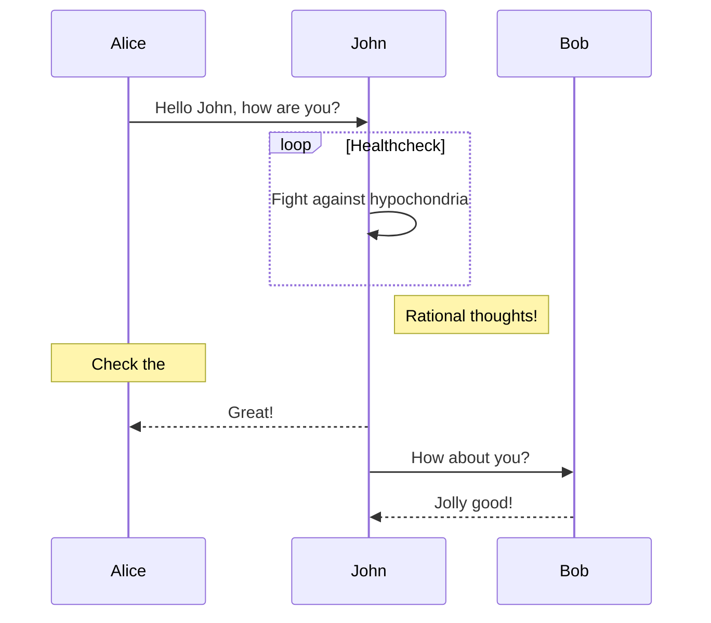
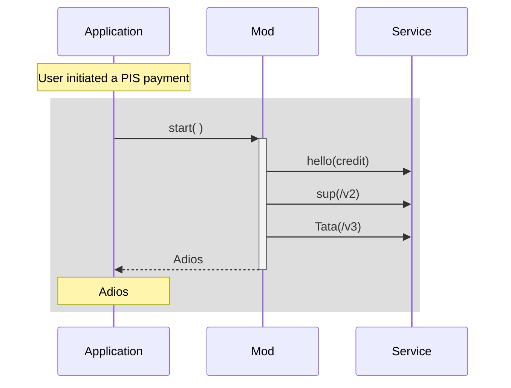

https://shd101wyy.github.io/markdown-preview-enhanced/#/diagrams




---


```plantuml

participant participant as Foo
actor       actor       as Foo1
boundary    boundary    as Foo2
control     control     as Foo3
entity      entity      as Foo4
database    database    as Foo5
collections collections as Foo6
queue       queue       as Foo7

participant A as Alice
participant J as John
participant B as Bob

A->>J: Hello John, how are you?
loop Healthcheck
    J->>J: Fight against hypochondria
end
Note right of J: Rational thoughts!
Note over A: Check the
J-->>A: Great!
J->>B: How about you?
B-->>J: Jolly good!
```

---


